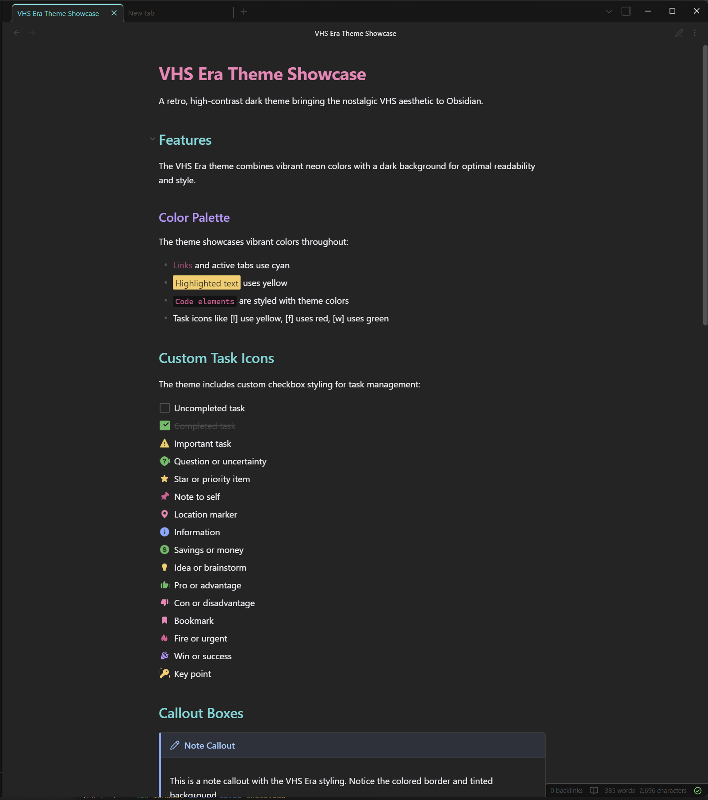

# VHS Era Theme for Obsidian

A retro, high-contrast theme for Obsidian that brings the nostalgic VHS aesthetic to your note-taking experience. Available in both dark and light modes, this theme combines the vibrant color palette of the VHS Era Neovim theme with the thoughtful structure of LYT-Mode, creating a unique visual experience that's both functional and stylish.




## Features

- 🎨 **Retro VHS Aesthetic**: Available in both dark and light modes
  - **Dark Mode**: High-contrast with dark backgrounds and vibrant accents
  - **Light Mode**: Warm, cream-toned backgrounds with eye-catching colors
- 🌈 **Color-Coded Headings**: Six distinct colors for hierarchical organization (H1-H6)
- 💻 **Syntax Highlighting**: Specialized colors for code blocks and inline code
- 📝 **Enhanced Readability**: High contrast design optimized for extended reading and writing
- 🎯 **Plugin Support**: Styled for popular plugins (Dataview, Calendar, Kanban)
- 📱 **Responsive**: Works great on both desktop and mobile
- 🌐 **Obsidian Publish Ready**: Includes styling for published sites

## Color Palette

### Dark Mode
**Base Colors:**
- **Background**: `#161616` - Deep black with subtle warmth
- **Text**: `#f2f4f8` - Crisp white for maximum readability
- **Selection**: `#353535` - Subtle gray for selected text
- **Muted Text**: `#525252` - For secondary information

**Accent Colors:**
- **Blue** (`#78a9ff`): Links, primary actions, keywords
- **Cyan** (`#3ddbd9`): H2 headings, important UI elements
- **Pink** (`#ff7eb6`): H1 headings, errors, methods
- **Purple** (`#be95ff`): H3 headings, strings, tags
- **Green** (`#42be65`): Success states, H5 headings
- **Yellow** (`#ffcc66`): Warnings, highlights, H6 headings
- **Light Blue** (`#82cfff`): H4 headings, numbers

### Light Mode
**Base Colors:**
- **Background**: `#e8e5d8` - Darker warm cream for better text contrast and retro aesthetic
- **Text**: `#1a1a1a` - Nearly black for excellent readability
- **Selection**: `#d0cdc0` - Warm gray
- **Muted Text**: `#5a5a5a` - Medium gray for secondary information

**Accent Colors (darkened for visibility):**
- **Blue** (`#4a7fd6`): Links, primary actions, keywords
- **Cyan** (`#1a9d9b`): H2 headings, important UI elements
- **Pink** (`#d63582`): H1 headings, errors, methods
- **Purple** (`#8b65d6`): H3 headings, strings, tags
- **Green** (`#2a9650`): Success states, H5 headings
- **Yellow** (`#b88a00`): Warnings, highlights, H6 headings (amber/gold)
- **Light Blue** (`#4a9fd6`): H4 headings, numbers

## Installation

### Method 1: Manual Installation

1. Download this repository as a ZIP file
2. Extract the contents
3. Copy the folder to your Obsidian vault's `.obsidian/themes/` directory
4. Open Obsidian Settings → Appearance → Themes
5. Select "VHS Era" from the dropdown

### Method 2: Via Obsidian Community Themes

_Coming soon - theme will be submitted to the Obsidian community themes gallery_

## Usage

### Recommended Settings

For the best experience with VHS Era theme:

1. **Fonts**: The theme looks great with DM Sans and DM Mono
   - Go to Settings → Appearance
   - Set "Text font" to `DM Sans` (or similar)
   - Set "Monospace font" to `DM Mono` or `JetBrains Mono`

2. **Line Width**: Set to 45rem or wider for comfortable reading
   - Settings → Editor → Readable line length

3. **Interface Scale**: Adjust to your preference
   - Settings → Appearance → Base font size

### Heading Colors

The theme uses a distinct color hierarchy for headings:

```markdown
# H1 - Pink (#ff7eb6) - Major sections
## H2 - Cyan (#3ddbd9) - Sub-sections
### H3 - Purple (#be95ff) - Topics
#### H4 - Light Blue (#82cfff) - Subtopics
##### H5 - Green (#42be65) - Details
###### H6 - Yellow (#ffcc66) - Fine details
```

### Callouts

All standard Obsidian callouts are supported with themed colors:

- `[!note]` - Blue
- `[!info]` - Light Blue
- `[!tip]` - Cyan
- `[!success]` - Green
- `[!warning]` - Yellow
- `[!error]` - Pink
- `[!example]` - Purple
- `[!quote]` - Gray

## Customization

### Custom CSS Snippets

You can create custom CSS snippets to further customize the theme:

1. Go to Settings → Appearance → CSS snippets folder
2. Create a new `.css` file
3. Add your custom styles using the VHS Era color variables

Example snippet to change link colors:

```css
/* For dark mode */
.theme-dark {
    --link-color: var(--vhs-cyan);
    --link-color-hover: var(--vhs-purple);
}

/* For light mode */
.theme-light {
    --link-color: var(--vhs-purple);
    --link-color-hover: var(--vhs-cyan);
}
```

### Available CSS Variables

The theme provides these custom variables you can use:

```css
/* VHS Era Base Colors */
--vhs-bg-primary: #161616
--vhs-bg-secondary: #131313
--vhs-fg-primary: #f2f4f8
--vhs-fg-muted: #525252

/* VHS Era Accent Colors */
--vhs-blue: #78a9ff
--vhs-cyan: #3ddbd9
--vhs-pink: #ff7eb6
--vhs-purple: #be95ff
--vhs-green: #42be65
--vhs-yellow: #ffcc66
```

## Plugin Compatibility

VHS Era theme includes specialized styling for:

- ✅ **Calendar** - Color-coded dates and today indicator
- ✅ **Dataview** - Themed tables and lists
- ✅ **Kanban** - Board and card styling
- ✅ **Graph View** - Node and edge colors
- ✅ **Excalidraw** - Compatible with dark backgrounds
- ✅ **Tasks** - Checkbox styling
- ✅ **Templater** - Syntax highlighting

## Known Issues

- Some third-party plugins may need additional styling tweaks
- Very long tables may require horizontal scrolling on smaller screens
- PDF exports use Obsidian's default export styling

## Contributing

Contributions are welcome! If you'd like to improve the theme:

1. Fork this repository
2. Create a feature branch
3. Make your changes
4. Submit a pull request

Please ensure any color changes maintain readability and accessibility.

## Roadmap

Future enhancements planned:

- [x] Light theme variant
- [ ] Additional color scheme variations
- [ ] More plugin-specific styling
- [ ] Custom checkbox styles (task types)
- [ ] CSS snippet library
- [ ] Theme settings panel

## Support

If you encounter any issues or have suggestions:

- Open an issue on GitHub
- Include your Obsidian version and theme version
- Provide screenshots if possible

## License

This theme is released under the MIT License. See [LICENSE](LICENSE) for details.

## See Also

### Inspiration & Credits

This theme would not exist without these excellent projects:

#### VHS Era Neovim Theme
- **Author**: Mistweaver Co.
- **Repository**: [mistweaverco/vhs-era-theme.nvim](https://github.com/mistweaverco/vhs-era-theme.nvim)
- **Credit**: Original color scheme and VHS aesthetic inspiration
- The beautiful retro color palette that defines this theme comes entirely from the VHS Era Neovim theme. All color values are used with respect to the original work.

#### LYT-Mode Obsidian Theme
- **Author**: Nick Milo
- **Repository**: [nickmilo/LYT-Mode](https://github.com/nickmilo/LYT-Mode)
- **Credit**: CSS structure, theme architecture, and Obsidian-specific styling patterns
- The organizational structure and many Obsidian-specific style implementations are based on LYT-Mode's excellent foundation.

### Related Projects

- [Obsidian](https://obsidian.md) - The powerful knowledge base that works on local Markdown files
- [Linking Your Thinking](https://www.linkingyourthinking.com) - Nick Milo's methodology for PKM
- [r/ObsidianMD](https://reddit.com/r/ObsidianMD) - Community discussion and themes

---

**Made with 💜 for the Obsidian community**

If you enjoy this theme, please consider:
- ⭐ Starring this repository
- 🐛 Reporting bugs or requesting features
- 🎨 Contributing improvements
- ☕ Supporting the original theme creators
